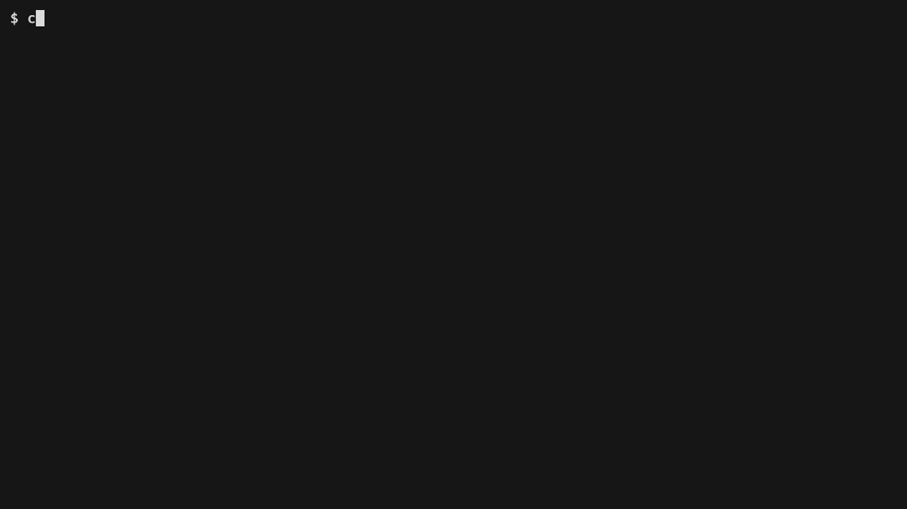

Hand-written code and LLM-generated code both drift. A pagination parameter or an access check is implemented slightly differently each time a person or a model touches it. Clay's model is the one machine-checked reference, and every generated file is checked against it. A master gauge did this job in 19th-century interchangeable-parts manufacturing: nothing passed that did not match it.

# Shelf

Shelf is a small [Clay](https://github.com/morkeleb/clay) app you can run and share. One entity, `Note`. The model is the source. Clay writes the types, the page, the forms, and the handlers. You write the business rule once, in a touch file, and a spec sits next to it.

```bash
npm install
npm run dev
```

Open http://127.0.0.1:4317. The header has a role control. It sends the `x-role` header. A reader can list notes. A reader who submits a form gets HTTP 403. An editor can create a note and rename a note. The store is in memory and starts with two notes.

`npm run dev` works after install. The generated files are already in the project.

## How Clay is set up

`clay/model.json` owns the fields, the queries, and the mutations. Six generators sit under `clay/generators/`, one folder each, created with `clay init generator`. Clay overwrites `src/generated/`. It writes each file under `src/logic/` once, then leaves it. `src/runtime/` is the server, the store, and the page script, written by hand.


The index page shows the note list and the selected note.

1. The list calls the generated `list` query.
2. A click calls the generated `get` query and shows that note.
3. The note has one button for each mutation.
4. The button opens the form for that mutation.
5. The form sends JSON to the generated handler.
6. The handler checks the caller role against the mutation `permission`.
7. The handler calls the touch file in `src/logic`.
8. The spec next to that file must be a real test. `npm test` fails while the spec still contains `implement this test`.

| Generator | Output |
| --- | --- |
| `types` | `src/generated/types.ts`, `src/generated/identity.ts` |
| `queries` | `list` and `get` |
| `handlers` | mutation handlers and `src/generated/routes.ts` |
| `forms` | one HTML form per mutation |
| `pages` | `src/generated/page.html` |
| `logic` | `touch: true` rule and spec |

## What generation buys you

You pay the model edit. Clay writes the files. The clips type the edit in `vi`, then show `git diff`.

### The LLM edits the model, not each file

One mutation in `clay/model.json` is the whole change. Clay writes the form, the handler, the page, the route, and the touch files. `git diff --stat` is the line count you did not have to buy from the LLM.


### One change, only the affected files

Add a field. Clay rewrites the type and the page. Handlers and queries stay as they are. The touch file still builds a `Note` without the new field, so `tsc` fails until you update it. The generated handler stays in sync. The hand-written rule does not.


Add a mutation. Clay writes the form, the handler, and the touch pair. The new spec is a scaffold. `npm test` fails until that test is a real test.



The same move works in a template. One line in the form template adds a Cancel button to every mutation form.


### The model only accepts its own vocabulary

`clay/validate-model.ts` checks `clay/model.json` before Clay runs. An unknown key fails, and the error names the allowed keys. `commands` is not a key. The name is `mutations`. This validation makes the model a fixed reference rather than documentation. Every generated file is checked against that one source instead of trusted to match by convention.


| Place | Allowed keys |
| --- | --- |
| file | `name`, `generators`, `model` |
| `model` | `identity`, `types` |
| role | `name`, `permissions` |
| type | `name`, `category`, `fields`, `queries`, `mutations` |
| field | `name`, `type`, `required`, `primary`, `description` |
| query | `name`, `permission`, `description` |
| mutation | `name`, `permission`, `description`, `input` |
| `input` | `fields` |

`category` is `entity`. A field `type` is `uuid`, `string`, or `boolean`. A query `name` is `list` or `get`. The entity has one primary field, and its name is `id`. Each `permission` appears on a role. `get` takes that id. `list` takes no input. A mutation other than `create` takes an `id` input. `create` does not take `id`.

### Generated files stay closed

`clay init-claude` writes `.claude/settings.json`. Before an Edit or a Write, Claude Code runs `clay check-generated`. A generated path is refused. The touch file under `src/logic/` is allowed, because Clay does not own it. That file is the one deliberately hand-authored surface, where judgment still lives, and the types and the tests matter most there because nothing upstream protects it. The clip is a small agent transcript. The refusal is the real hook.


### Security lives in the template

The role check is one line in the handler template. Clay copies it into every handler. A reader who calls a mutation gets HTTP 403 from that check. Access-control drift is structurally impossible here: the check is in the template, so a handler cannot omit it, and the tests are not what keep it in place.


## Commands

| Command | Action |
| --- | --- |
| `npm run dev` | Serve the page on port 4317 |
| `npm run validate` | Reject a model that renames a concept or adds an unknown key |
| `npm run generate` | Validate the model, then run Clay |
| `npm run typecheck` | Run `tsc` |
| `npm test` | Require a real spec for each touch file, then run the tests |
| `npm run check` | Validate, typecheck, and test |
| `npm run gifs` | Record the clips above |

Record the clips again with [VHS](https://github.com/charmbracelet/vhs) on your `PATH`:

```bash
npm run gifs
```

The script returns the model to this baseline when it finishes. The baseline has no `pinned` field and no `archive` mutation.

## Local Clay checkout

The dependency is the published `clay-generator` package. To use the sibling checkout at `../clay` instead:

```bash
cd ../clay
npm link
cd ../clay-example
npm link clay-generator
```
